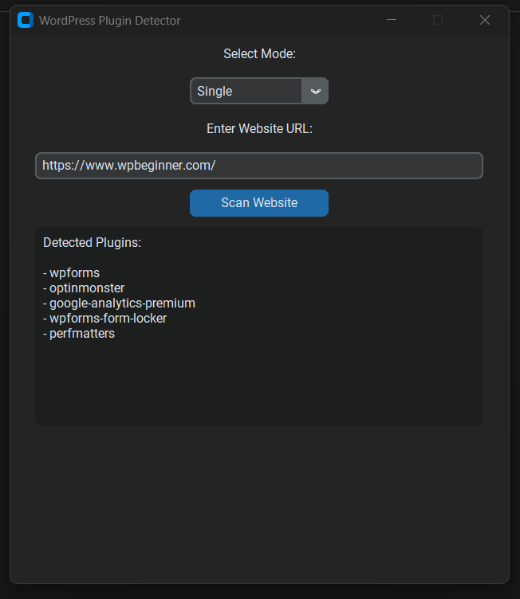
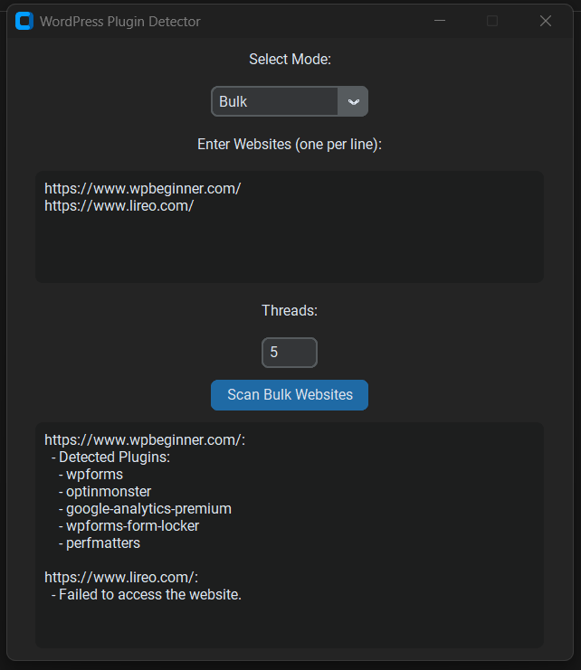

# WP Plugin Scanner
A python powered GUI tool for scanning for WordPress plugins on the homepage source code of the given website

# Features
- Simple GUI
- Easy to use
- Supports Single and Bulk mode with threading system support

# Compiled Version Usage
- The compiled version of the app can be found in the `dist` directory.
- To run the compiled version, just double-click the executable file.

# Installation
- Clone the repository: `git clone https://github.com/yourusername/wp-plugin-scanner.git`
- Navigate to the project directory: `cd wp-plugin-scanner`
- Install dependencies: `pip install -r requirements.txt`
- Run the app: `python plugin_finder.py`

# Usage
1. Enter the website URL in the input field.
2. Click the "Scan" button.
3. Wait for the scan to complete.
4. The results will be displayed in the output field.

# Screenshots
* Single Mode 

 
* Bulk Mode 
